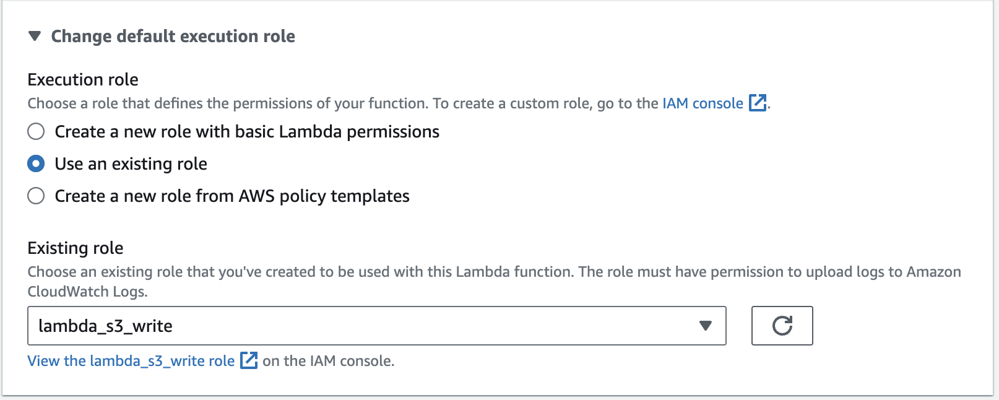
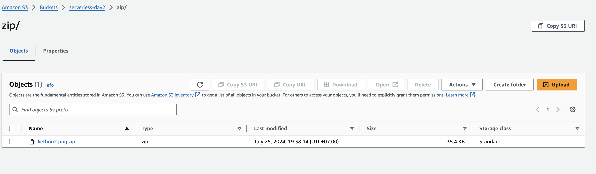

### Amazon S3 Events Overview

#### Amazon S3 events can be configured to go to multiple destinations including:

- AWS Lambda
- Amazon Simple Notification Service (SNS)
- Amazon Simple Queue Service (SQS)


Directly responding to Amazon S3 events using an AWS Lambda function is ideal when you require simple compute tasks to be executed on-demand. Alternatively, you can configure Amazon S3 to publish a new message on an Amazon SNS topic, and use this single event to trigger multiple destinations, such as:

Mobile push
SMS messages
HTTP endpoints
SQS queues
In this lab, you will see a simple scenario where a single AWS Lambda function will be invoked every time a new Amazon S3 object is uploaded. Please note that the model used is non-stream based (i.e. asynchronous).

What type of events can be triggered?
There are three main types of events, with a few sub-types depending on the API call used.

The three main event types are:

ObjectCreated - Triggered on both creation and update of an S3 Object (Put, Post, Copy, or CompleteMultipartUpload)
ObjectRemoved - Triggered on deletion, batch-deletion or versioned object marked for deletion (Delete or DeleteMarkerCreated)
ReducedRedundancyLostObject - RRS storage class object loss
Note that the event's configuration must be set up on the S3 Buckets and that you won't receive notifications for failed operations.
 

In the next steps, you will create a new S3 Bucket and connect its ObjectCreated events to AWS Lambda.


### Creating an Amazon S3 Bucket


1. In the AWS Management Console search bar, enter S3, and click the S3 result under Services:

2. From the S3 console, click Create bucket:


3. Under General configuration, enter the following values:


Bucket name: Enter a unique name beginning with calabs-bucket-(unique-id)
Add some random letters and numbers to make the bucket name unique 
AWS Region: Ensure US West (Oregon) us-west-2 is selected


4. Make sure to select ACLs Enabled:


5. Leave the Block public access (bucket settings) at the default values:


6. To finish creating your bucket, scroll to the bottom, and click on Create bucket.


### Implementing an AWS Lambda Function to Process Amazon S3 Events

The function will be triggered by upload events to the images prefix of the Amazon S3 bucket. Upon an image upload, it will compress the image, and put the compressed image into a prefix called zip.

Using separate prefixes for the image and zip files will allow you to avoid an infinite loop. This is achieved by using one prefix for uploads and specifying that the trigger only acts on events from that prefix. This is a simple way to avoid recursive trigger events for the purposes of this lab.


1. In the AWS Management Console search bar, enter Lambda, and click the Lambda result under Services:

2. In the top-right corner, click Create function:


3. Set up the Basic Information page as follows:
Function name: ZipS3Images
Runtime: Python 3.8

4. Under Permissions, click Change default execution role.

5. Under Execution role, select Use an existing role:
The AWS Lambda function will require read and write access to the  Amazon S3 bucket. Therefore, make sure you choose an existing role and select the lambda_s3_write execution role before confirming the Lambda function creation.




4. Click Create function.

You will see the details page of your newly created function.


5. Scroll down to the Code source section, double-click the lambda_function.py file and replace the contents with the following code:

```python
import os, zipfile
from io import BytesIO
import boto3
s3 = boto3.client('s3')
def lambda_handler(event, context):
    # read bucket and key from event data
    record = event['Records'][0]['s3']
    bucket = record['bucket']['name']
    key = record['object']['key']
    # generate new key name
    new_key = "zip/%s.zip" % os.path.basename(key)
    # read the source obj content
    body = s3.get_object(Bucket=bucket, Key=key)['Body'].read()
    # create new obj with compressed data
    s3.put_object(
        Body=compress(body, key),
        Key=new_key,
        Bucket=bucket,
    )
    return "OK"
def compress(body, key):
    data = BytesIO()
    with zipfile.ZipFile(data, 'w', zipfile.ZIP_DEFLATED) as f:
        f.writestr(os.path.basename(key), body)
    data.seek(0)
    return data.read()
```


Here's an explanation of this function code:

- The lambda_handler function is extracting information about the event that triggered it from the event parameter.
- The function retrieves the body of the uploaded file.
- The function creates a new object in the zip prefix, calling the compress function on the body of the uploaded file.
- The compress function compresses data using the Zip compression algorithm.


7. To change the Timeout of the function, click the Configuration tab, and click Edit:


You have increased the timeout of the function because the default value is too short for your compression function.


9. To save your change to the timeout, at the bottom of the form, click Save.

You will be returned to your functions Configuration tab.

10. Go to the Function overview panel at the top, click + Add trigger, and select S3:

As previously mentioned, you will use a prefix to avoid infinite event recursion and a suffix to filter only png images. The Lambda Function will be invoked every time an object is created or updated and will create a compressed version of the image.

11. Configure the S3 trigger parameters as follows:

- Bucket: Select the unique bucket name you used
- Event Type: All object create events
- Prefix: images/ (Don't' forget to include a trailing slash (/))
- Suffix: .png


AWS is reminding you that using the same S3 bucket for input and output can lead to infinite recursive loops of operations. In this lab, you are avoiding this by using different prefixes and specifying a suffix. In a non-lab environment, you should prefer using separate S3 buckets.

12. Click Add to add the trigger.


### Testing the Amazon S3 Trigger

1. Navigate to the Amazon S3 console.

2. In the list of buckets, click your bucket name.

3. To create a prefix for images, click Create folder:

The Create folder form will load.

4. In the Folder name textbox, enter images:

Leave other options at their defaults.


5. To finish creating the images prefix, scroll to the bottom and click Create folder.

You will see the details page for the Amazon S3 bucket load and the Objects tab will be selected.

6. Click the images folder:


7. To start uploading a file, click Upload:


8. Upload a PNG file either by dragging it onto the folder icon or by clicking Add files and using the file picker.

Important!: Upload PNG files that have no spaces in the filename. The code only recognizes file names with the following convention <filename>.png. A flle named "My file.png" will not throw an error, but Lambda will never pick up the file, compress it and drop it into the zip folder.

If you do not have a PNG file available, you can download this PNG image to your local computer and upload it.


9. To return to the root of your bucket, at the top, click the bucket name:


In addition to the images folder that you created, you will see a zip folder:

This was created by your AWS Lambda function when it was invoked after you uploaded a file.

12. To see the compressed uploaded file, click the zip prefix.

You will see a file with the zip extension.




13. To inspect the file, select the file by checking the left-hand checkbox, click Actions, and click Download as.

14. To download the compressed file, click the displayed link.


15. In the AWS Lambda console, take a look at the Monitor tab of your function.

You will see some Amazon CloudWatch charts.

The Invocations chart shows you how many times your function was executed.


### Summary
In this lab, you used the AWS Management Console to create an Amazon S3 bucket, and you implemented an AWS Lambda function that compresses files uploaded to your Amazon S3 bucket. You also configured your AWS Lambda function to be triggered when a PNG file is uploaded to the images folder. And you tested your function and its trigger by uploading a PNG file to your bucket.
