## Configure Amazon DynamoDB triggers with AWS Lambda

### Enable Streams on a DynamoDB Table

DynamoDB Streams are designed to allow external applications to monitor table updates and react in real-time.

Once you enable DynamoDB Streams on a table, an ordered flow of record modifications will become available via a custom API endpoint. 
Basically, every time you create, update, or delete records from the table, DynamoDB will write a new stream record containing the corresponding record data.

The stream record information can be configured for each table, choosing between one of the following options:

- Keys only - The record will contain only the key attributes of the item.
- New image - The record will contain the entire item after it was modified.
- Old image - The record will contain the entire item before it was modified.
- New and old image - The record will contain both the new and the old items.

Please note that stream records are available almost in real-time and always in the correct order. This way, external applications can take arbitrary actions, such as sync cross-region tables, send mobile notifications based on new content, compute real-time usage metrics, etc.

Also, remember that enabling streams is free and you will be charged only based on the number of read request units. As of July 2020, the first 2.5M requests each month are free, then additional charges apply based on region. A request unit corresponds to a call to the GetRecords API, which can return up to 1MB of data.

In order to receive DynamoDB updates, you need to enable each table's stream. In this lab step, you will walk through how to enable streams on a DynamoDB table.


1. In the AWS Management Console search bar, enter DynamoDB, and click the DynamoDB result under Services:
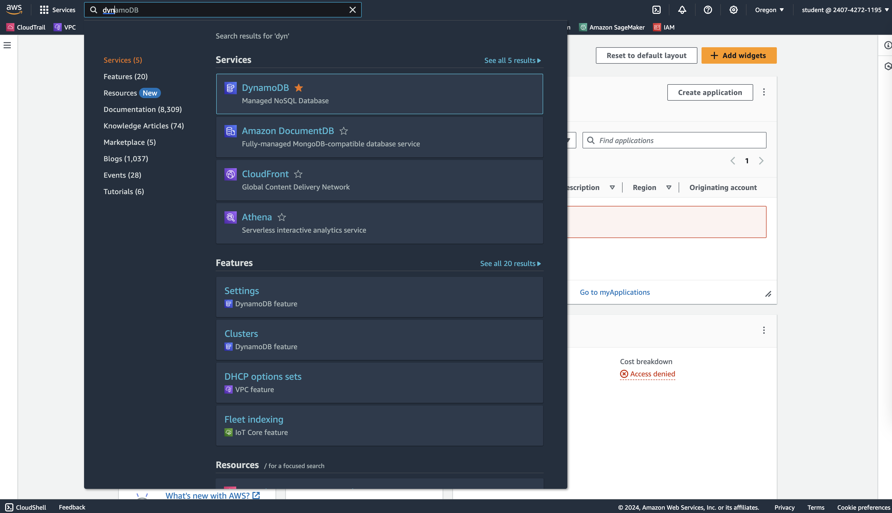


2. On the left-hand side, click Tables.
A DynamoDB table has already been created at the start of this lab.

4. Click the Exports and streams tab:

5. In the DynamoDB stream details section, click Enable:

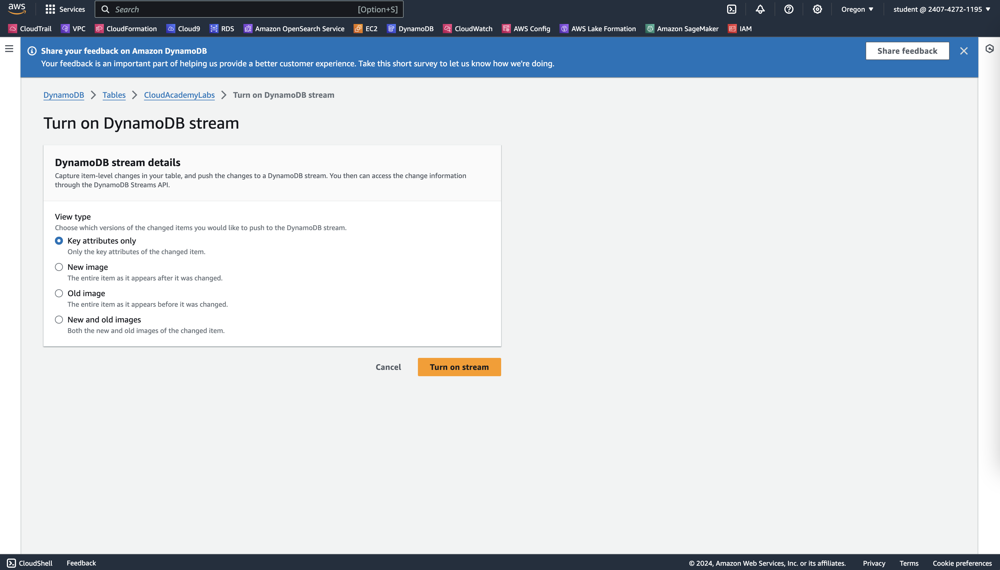


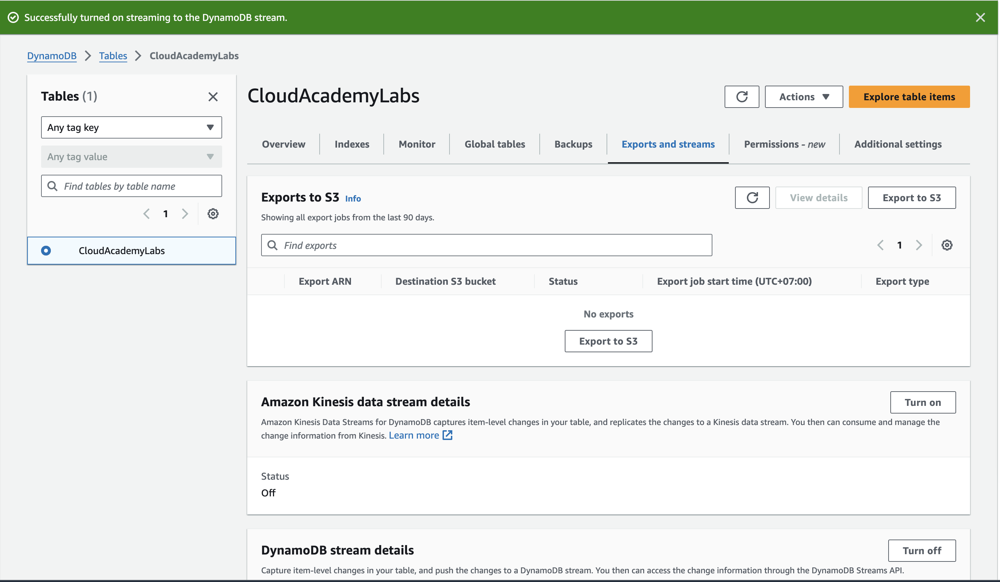


### Implement Lambda Function batch processing logic

In this lab step, you will create a new Lambda Function and connect it to the DynamoDB Stream. The table will contain basic data about users, defining only the following fields:

- Id: Primary Key (PK) for the table.
- Email: The user's email address.
- IsPersonalEmail: An automatically computed field, based on the Email value.

You will implement a simple trigger to keep the IsPersonalEmail and Email fields synchronized: every time a new record is created, the Lambda Function will add the computed field (IsPersonalEmail). Additionally, each time a record is updated,  the two fields will keep in sync.

The following is a list of possible scenarios to account for:

1. A new record is created: The Lambda Function initializes IsPersonalEmail with the correct value.
2. A record is modified, but Email hasn't changed: No operation.
3. A record is modified, Email has changed, but IsPersonalEmail is still the same: No operation.
4. A record is modified, Email has changed and IsPersonalEmail needs to be updated: The record will be modified.


Instruction

1. In the AWS Management Console search bar, enter Lambda, and click the Lambda result under Services:


2. On the AWS Lambda console, click Create Function, ensure Author from scratch is selected and input the following:

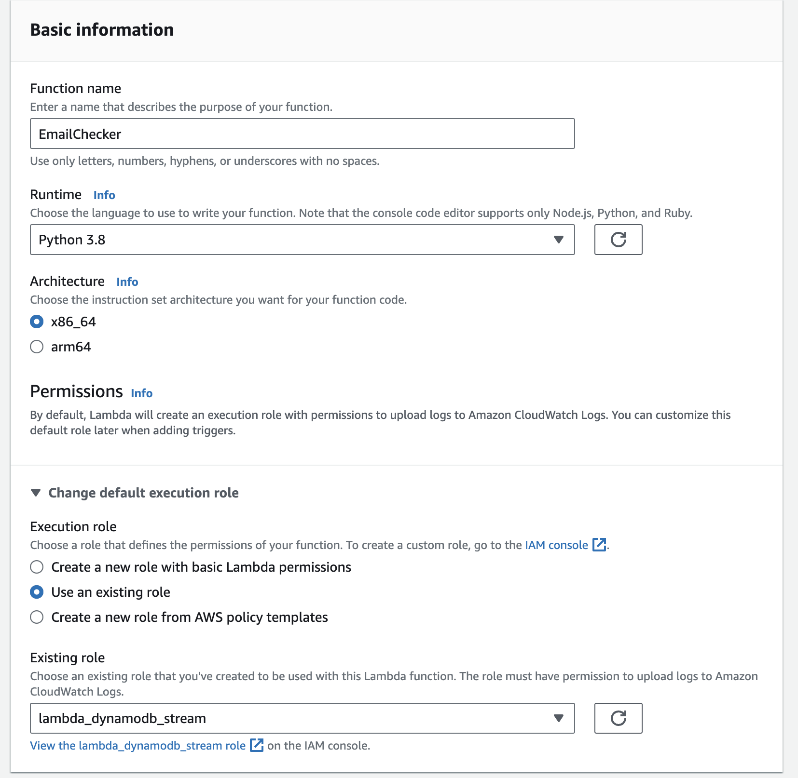

3. Click Create function:

4. On the EmailChecker details page, scroll down to the Code source section and double click the lambda_function.py file.
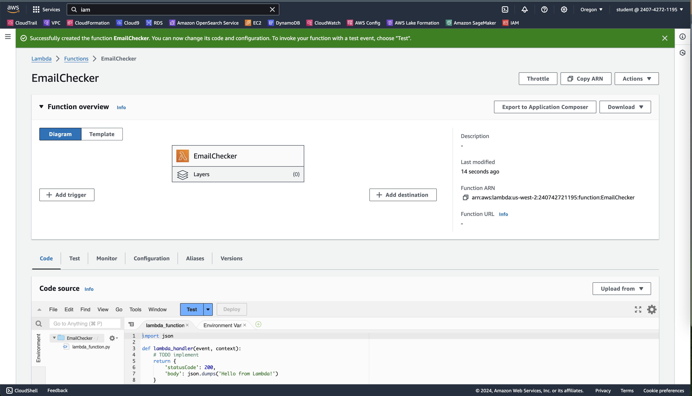


5. To implement the function, replace the contents of the editor with the following code and click Deploy:

```python
import json
import boto3
DDB = boto3.resource("dynamodb").Table("CloudAcademyLabs")
def lambda_handler(event, context):
    records = event["Records"]
    print("Received %s records" % len(records))
    for record in records:
        print(record)
        # if new record or update
        if record["eventName"].upper() in {"INSERT", "MODIFY"}:
            # primary key
            record_id = record["dynamodb"]["Keys"]["Id"]["S"]
            # init local vars
            old_email = old_is_personal = new_email = new_is_personal = None
            # new and old images
            old_image = record["dynamodb"].get("OldImage") or {}
            new_image = record["dynamodb"].get("NewImage") or {}
            # old values (optional, only on update)
            if "Email" in old_image:
                old_email = old_image["Email"]["S"]
            if "IsPersonalEmail" in old_image:
                old_is_personal = old_image["IsPersonalEmail"]["BOOL"]
            # new values
            if "Email" in new_image:
                new_email = new_image["Email"]["S"]
                new_is_personal = is_personal_email(new_email)
            # avoid recursion on update and write only if strictly needed
            if old_email != new_email and old_is_personal != new_is_personal:
                update_record(record_id, new_is_personal)
    print("Processed %s records" % len(records))
def update_record(record_id, is_personal):
    print("Updating %s: IsPersonalEmail=%s" % (record_id, is_personal))
    DDB.update_item(
        Key={"Id": record_id},
        UpdateExpression="SET IsPersonalEmail = :val",
        ExpressionAttributeValues={":val": is_personal or False},
    )
def is_personal_email(email):
    domains = {"gmail.com", "outlook.com", "hotmail.com"}
    return any(email.endswith(domain) for domain in domains)
```

The Lambda handler is split into three functions:

- is_personal_email: Checks whether the given email contains a commercial email domain commonly used for personal accounts
- update_record: Updates the DynamoDB record, given an ID and a boolean value
- lambda_handler: Analyzes the given batch of records and extracts the data for each record


Please note that the Lambda Function is invoked for every DynamoDB update, deletions included. The lambda_handler function only processes the INSERT and MODIFY records. Therefore, the main function verifies which records need to be updated based on the OldImage and NewImage record fields.

The compute logic could have been simpler, however, keep in mind the goal of the Lambda Function. It is important to design the function to reduce the amount of DynamoDB writes, and Lambda invocations. To avoid infinite recursion, the records are only updated if needed.

6. To see the timeout of the function, click the Configuration tab.

The General configuration section will be displayed and you will see a Timeout field.

7. To change the function's timeout, click Edit, change the value of the Timeout to 1 minute, and click Save.

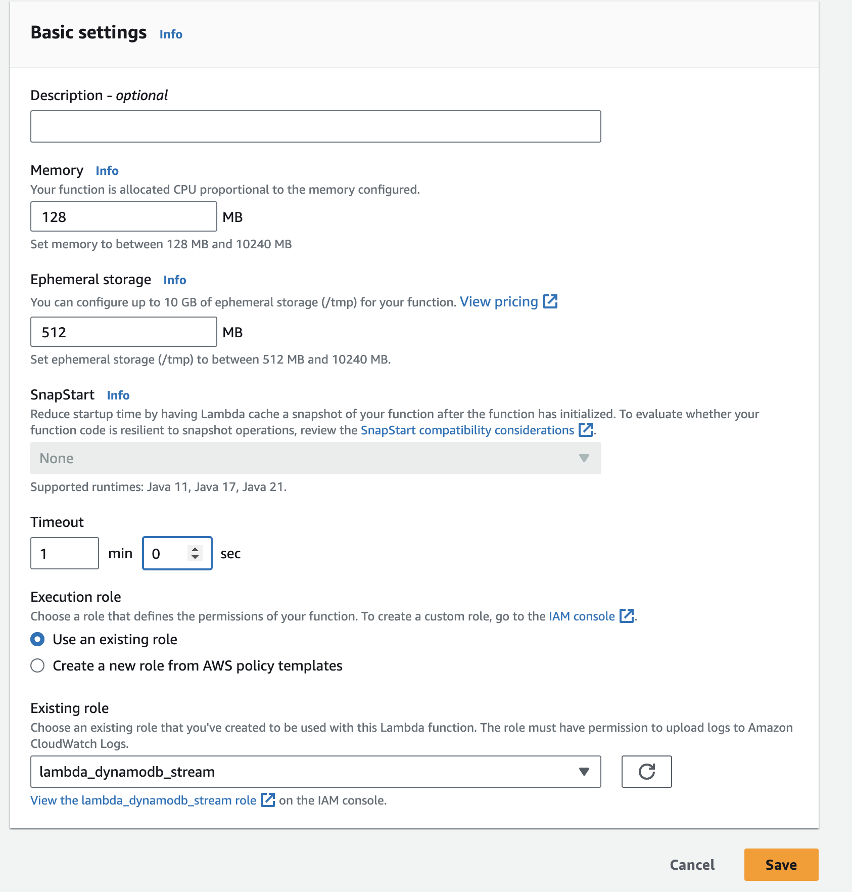

Given the high batch size, the timeout should be increased to 60 seconds.

Note: All other settings should be left at their defaults.


8. In the Function overview section, click Add trigger:

9. Type dynamo into the search box and click DynamoDB:
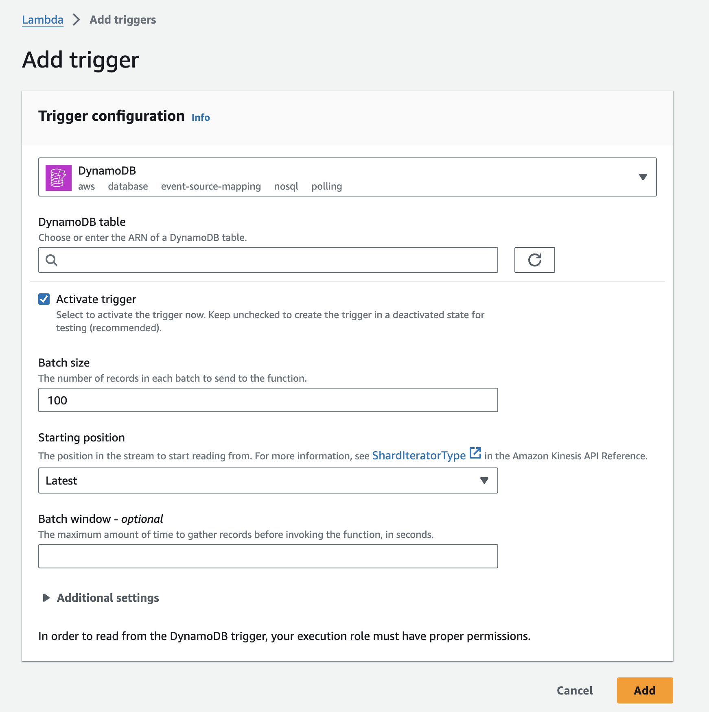


10. In the Trigger Configuration menu, input the following before clicking Add. Keep the rest of the settings as defaults:

- DynamoDB table: Select CloudAcademyLabs from the dropdown menu
- Starting position: Select Trim horizon from the dropdown menu


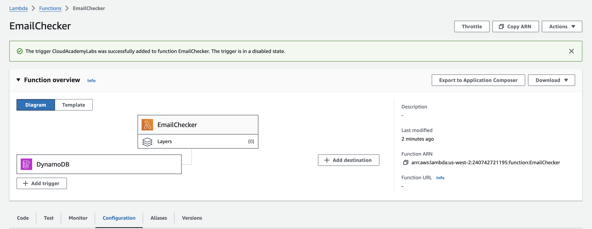


### Test the DynamoDB Trigger

1. Return to the DynamoDB Tables page.

2. Click the CloudAcademyLabs table name:

3. Click Explore table items:
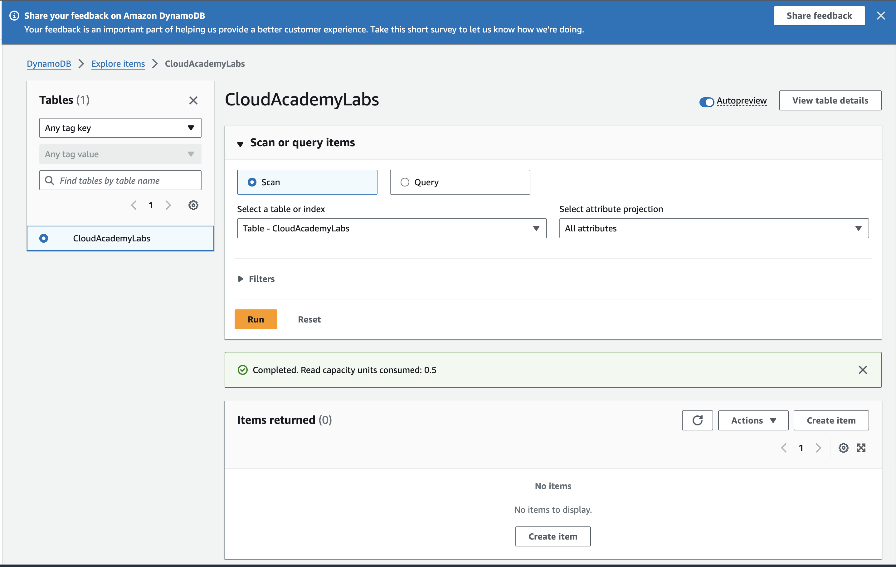

4. On the Items page, in the Items returned section, click Create Item:

5. On the Create item page, click JSON to switch from the form input to a JSON input:

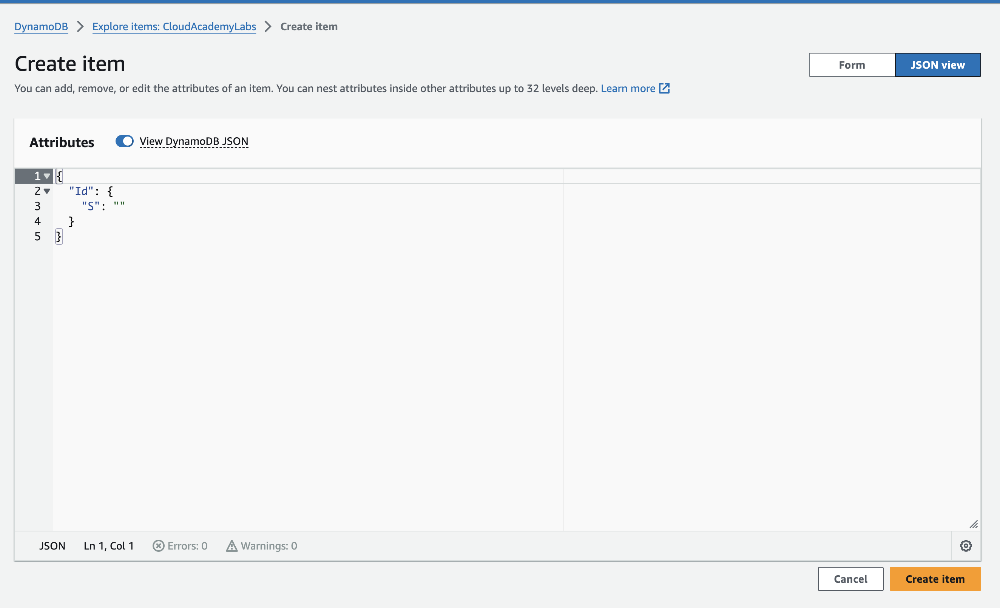

6. In the Attributes field, paste in the following to define your DynamoDB JSON object:

```JSON
{
 "Id": {
  "S": "ID1"
 },
 "Email": {
  "S": "john@example.com"
 }
}
```

7. Click Create item at the bottom of the page:

You will return to the Items page for your DynamoDB table.


8. In the Items returned section, you will see the item you created along with an additional field IsPersonalEmail:
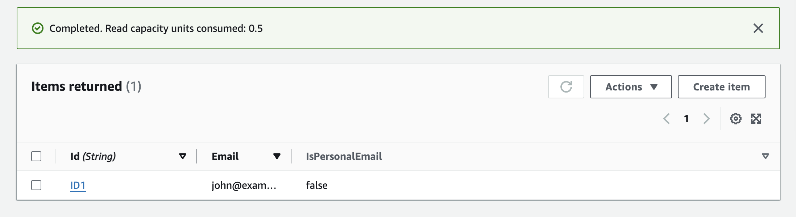

Since "example.com" is not in the list of commercial email domains, this email will be marked as not personal.


9. Repeat the process above to create a second item with a different email - for example, john@gmail.com and ID - for example ID2. The new item's email will be marked as personal:

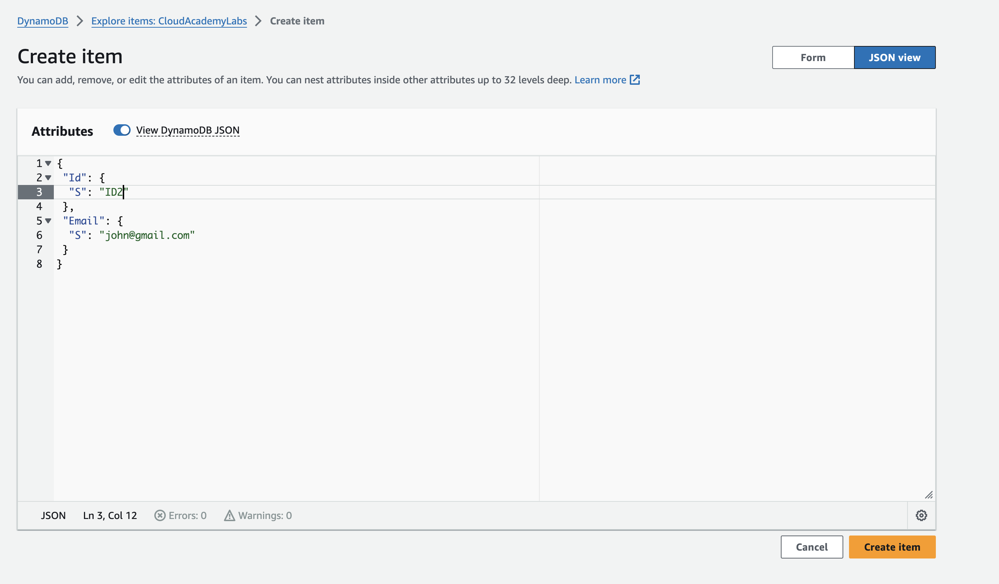

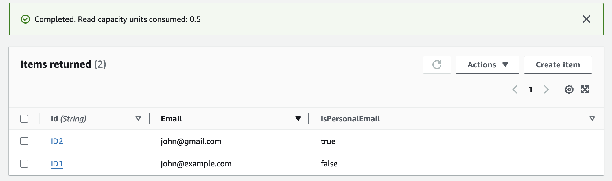

The same will happen if you modify an existing item's email: the value of IsPersonalEmail will be updated accordingly.

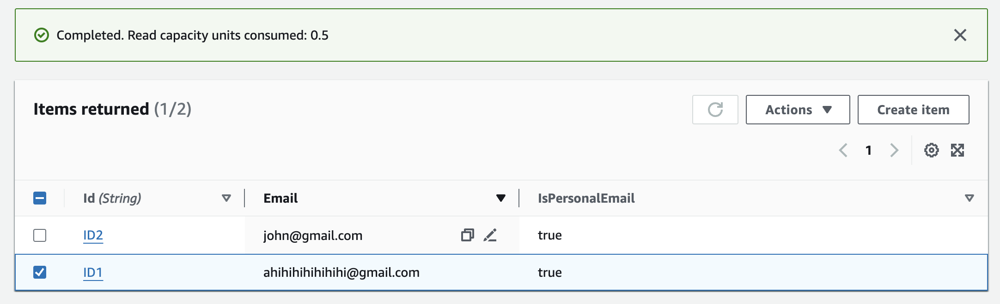

