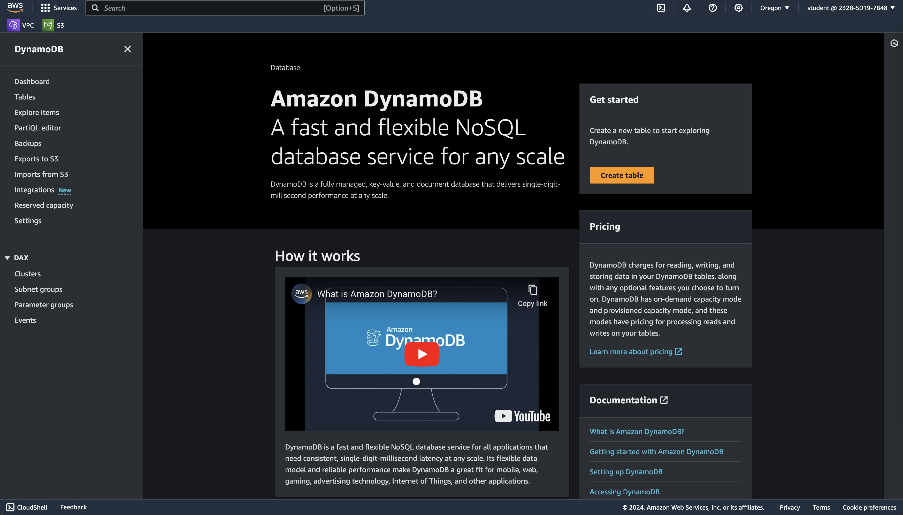
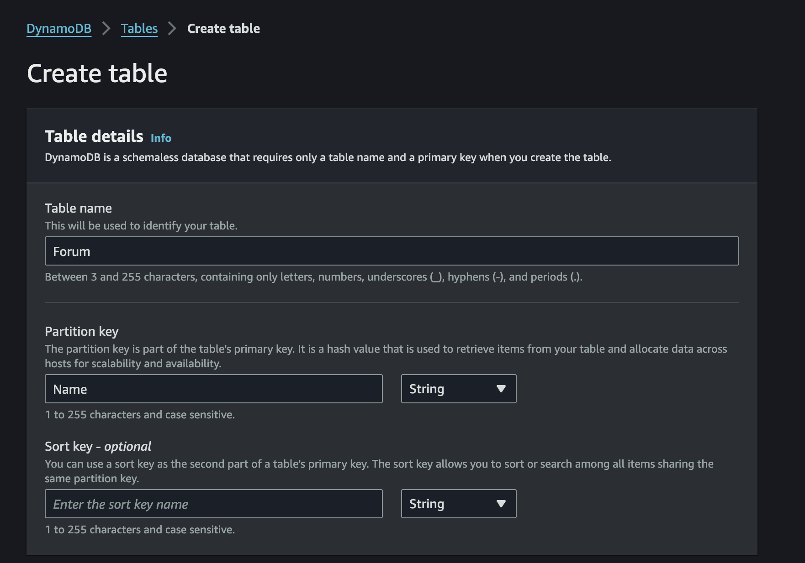
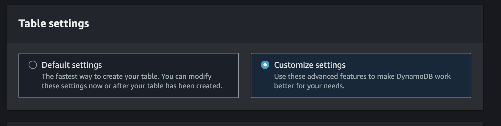
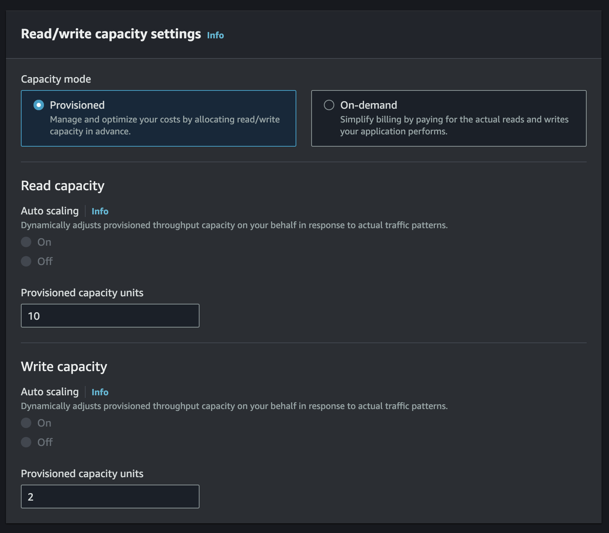
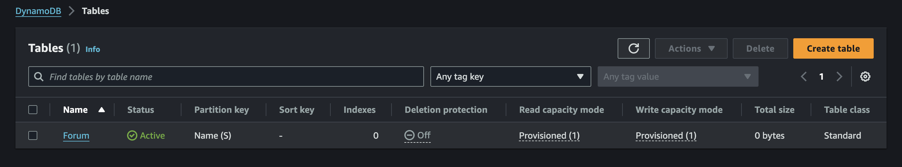
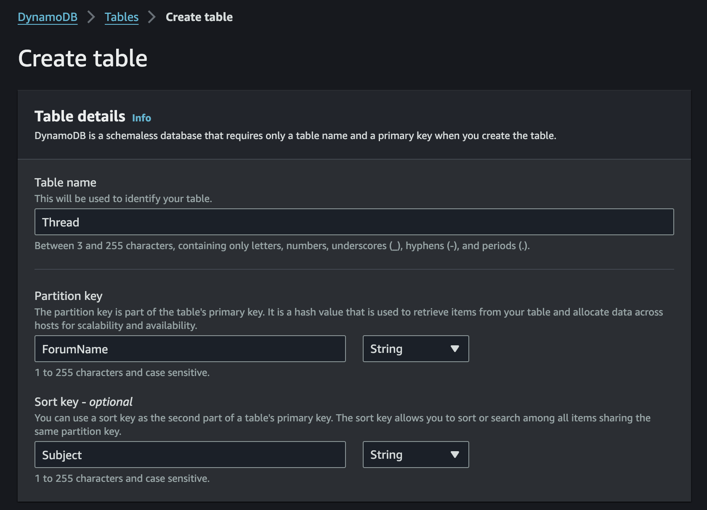
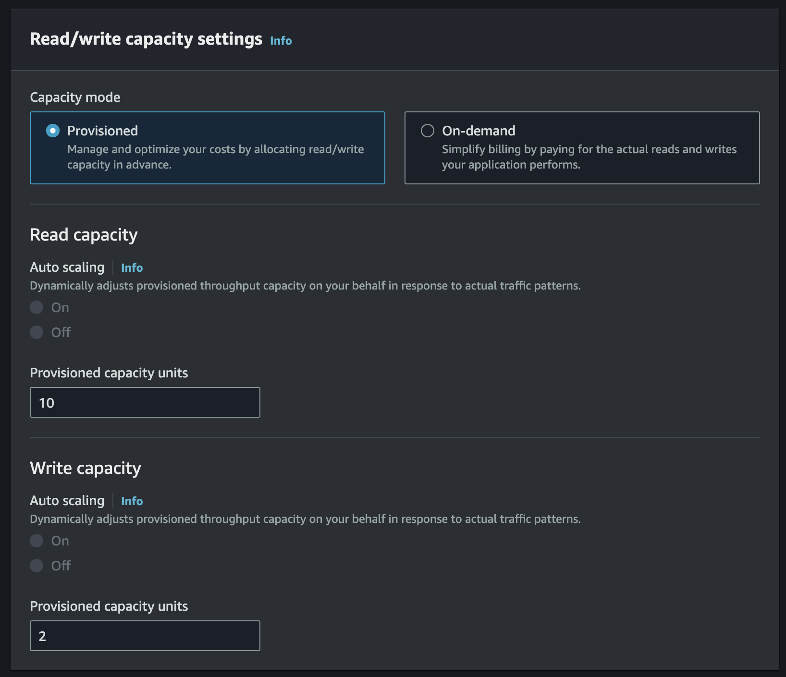

## Introduction to DynamoDB

Amazon DynamoDB is a NoSQL Database in the cloud, suitable for anyone needing a reliable and fully managed NoSQL solution. DynamoDB is designed to provide automated storage scaling and low latency. It is particularly useful when your application must read and store massive amounts of data and you need speed and reliability (Amazon works with replicas of your database in three different Availability Zones). Amazon DynamoDB is totally managed. You simply select an AWS region, define the needed indexes for each table you will create, and Amazon takes care of everything else.

### Creating a DynamoDB Table with a Partition Key

1. From the AWS Management Console, in the search bar at the top, enter DynamoDB, and under Services, click the DynamoDB result:

2. To start creating a new DyanmoDB table, on the right-hand side, click Create table:

3. In the Table details section, enter the following:

- Table Name: Forum
- Partition Key: Enter Name and ensure type is String

4. In the Settings section, select Customize settings:

Choosing this option allows you to specify values for the table's read and write capacities.

5. In the Read/write capacity settings section, under Capacity mode, select Provisioned and enter the following:

- Read Capacity: 
    Provisioned capacity units: 10
- Write Capacity: 
    Provisioned capacity units: 2

6. Scroll to the bottom and click Create table:

### Creating a DynamoDB Table with Local and Global Secondary Indexes

1. On the right-hand side of the page, click Create table:

2. Enter the following in the Table details section:

- Table name: Thread
- Partition key:
    Name: Enter ForumName
    Type: Select String
- Sort key:
    Name: Enter Subject
    Type: Select String

3. In the Settings section, select Customize settings.

4. Under Read/write capacity settings, ensure Provisioned is selected for Capacity mode, and enter the following:

- Read capacity:
    Provisioned capacity units: 10
- Write capacity:
    Provisioned capacity units: 2

5. Scroll down to the Secondary indexes section and click Create local index:

6. Enter the following to configure your local secondary index:
